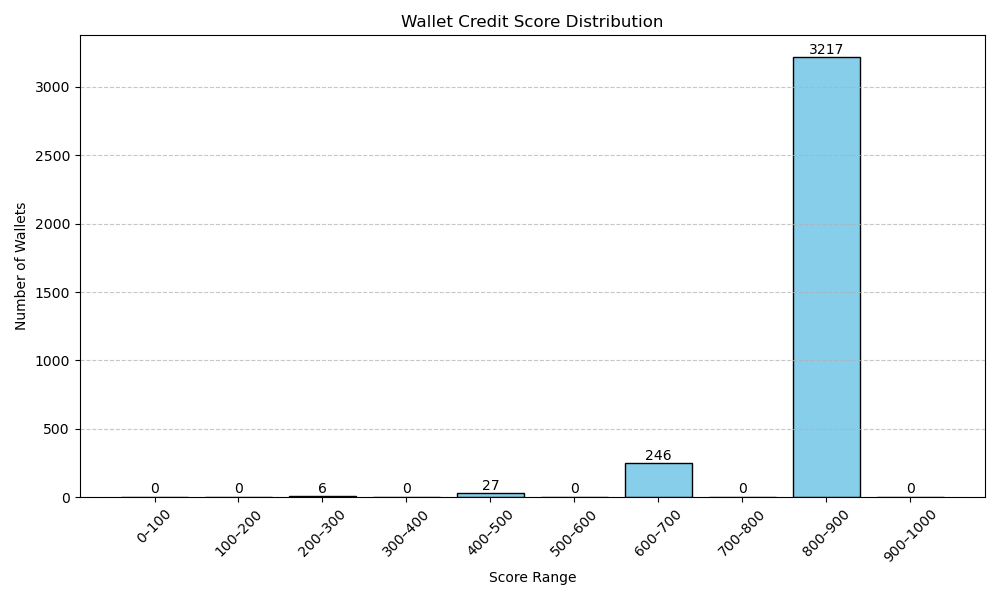

This analysis evaluates the distribution and behavioral characteristics of wallets scored based on their activity in the Aave V2 protocol.

## Score Distribution

The wallets were assigned credit scores in the range of 0 to 1000. The distribution of scores across predefined ranges is as follows:
| Score Range | Number of Wallets |
| ----------- | ----------------- |
| 0–100       | 0                 |
| 100–200     | 0                 |
| 200–300     | 6                 |
| 300–400     | 0                 |
| 400–500     | 27                |
| 500–600     | 0                 |
| 600–700     | 246               |
| 700–800     | 0                 |
| 800–900     | 3217              |
| 900–1000    | 0                 |

## Score Distribution Graph

Below is the visual representation of the wallet credit score distribution:

## Behavior of Wallets

## Wallets in the Lower Range (0–500)
Very few wallets fall in this category (only 33 wallets in total).
These wallets exhibit limited or sporadic activity on the Aave V2 protocol.
Behavior includes:
Infrequent deposits
Minimal borrow-repay cycles
Early liquidations
Likely to be new, inactive, or opportunistic users.

## Wallets in the Middle Range (600–700)
A moderate number (246 wallets) fall in this range.
These wallets are active but may not fully utilize borrowing or repayment features optimally.
Likely to be consistent depositors with cautious borrowing behavior.

## Wallets in the Higher Range (800–900)
The majority of wallets (3217) lie in this range.
These wallets demonstrate healthy financial behavior:
Frequent and timely repayments
Balanced use of borrowing and depositing
Rarely involved in liquidation events
Likely to be experienced DeFi users or institutional wallets.

## Conclusion

The score distribution shows a strong skew toward higher credit scores, indicating that most wallets interacting with Aave V2 maintain healthy on-chain behavior.
These insights can support:
Risk modeling
Designing incentive mechanisms
User segmentation strategies in DeFi protocols

